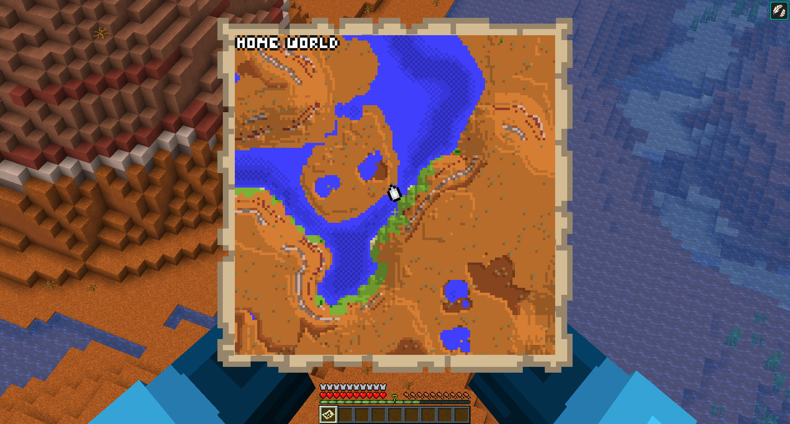
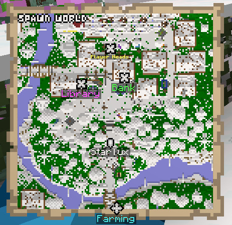

# Magic Map

The Magic Map renders the world around the player, following them around as they explore.

## Technical

This plugin reserve one single map ID, which it will use indefinitely.
The ID is stored in the `mapid.json` file which should never be
removed.  Each player will receive the same map item, yet they render
different contents for each player.

The map is rendered using custom code but the result is very similar
to vanilla map rendering.  Block colors come straight from the
Minecraft code and can edited if needed via the `colors.txt` file.
The plugin can also attempt to re-import them; however because NMS
code reflection is involved, there is no guarantee of success.

# Labels

Labelled pins can be displayed on a map, including other players,
armor stands, and even mobs. The `config.yml` provides options to
regulate this behavior.
